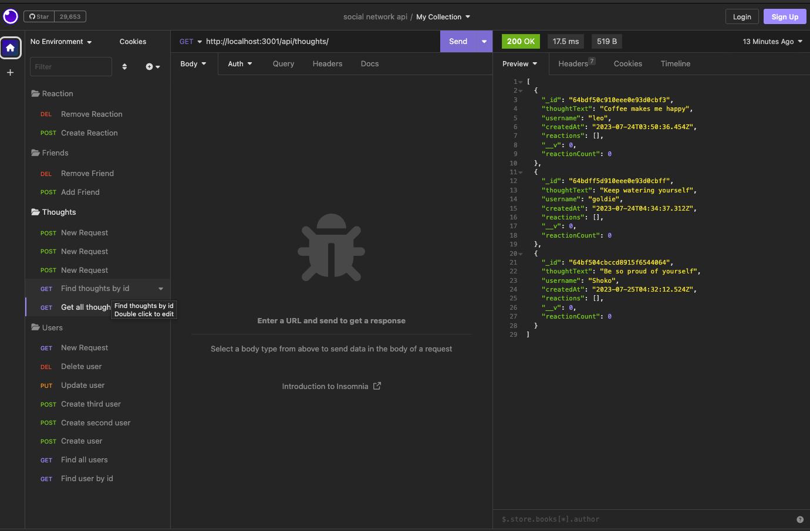
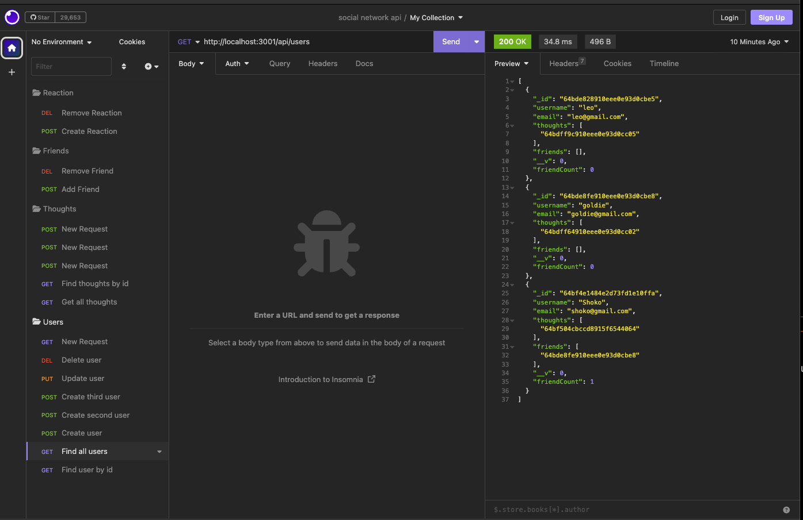
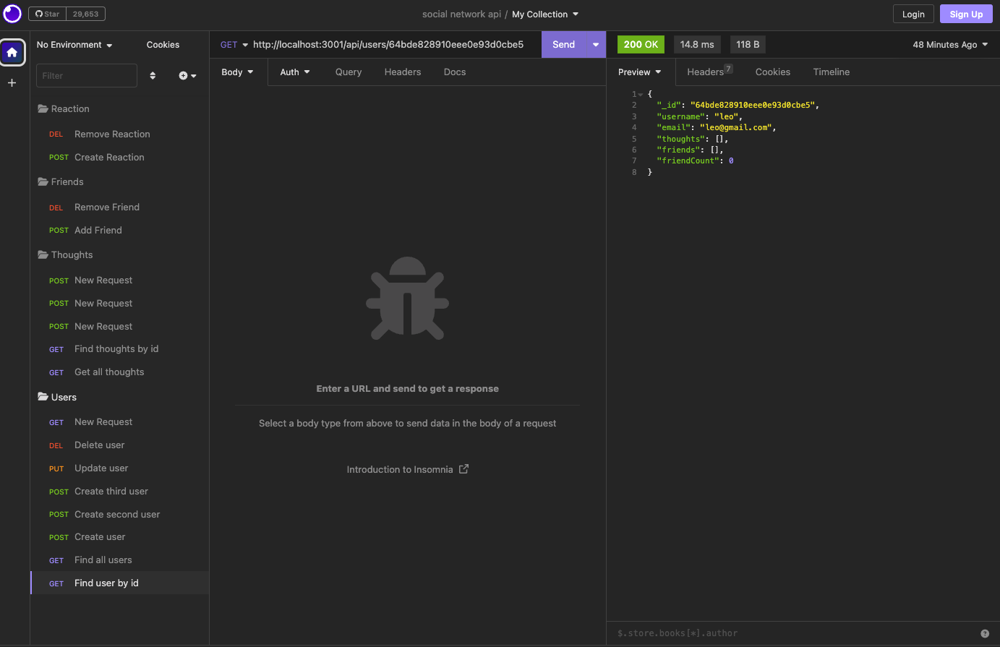
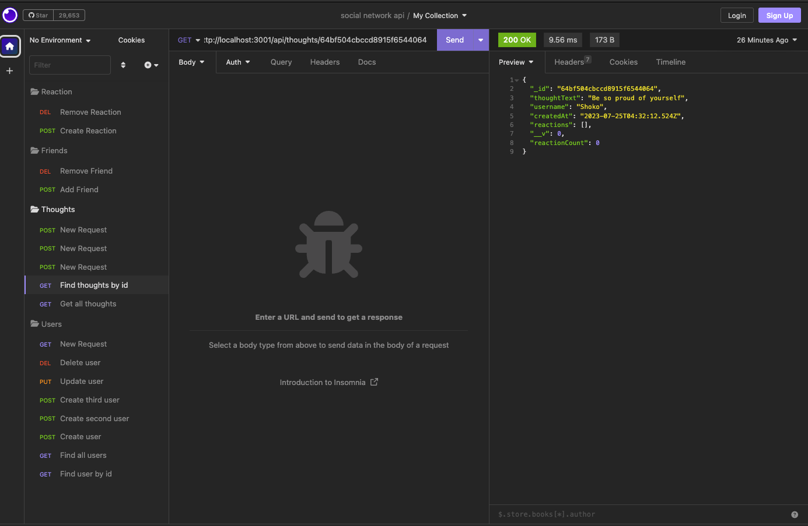
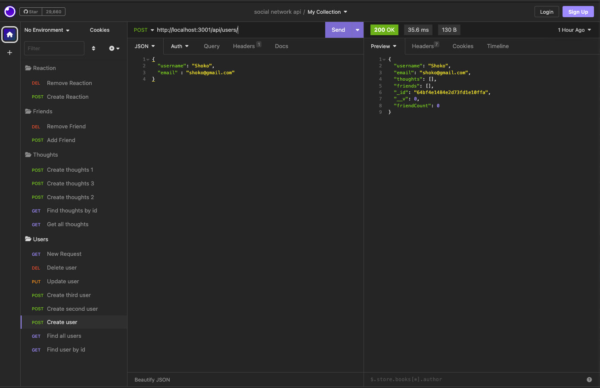
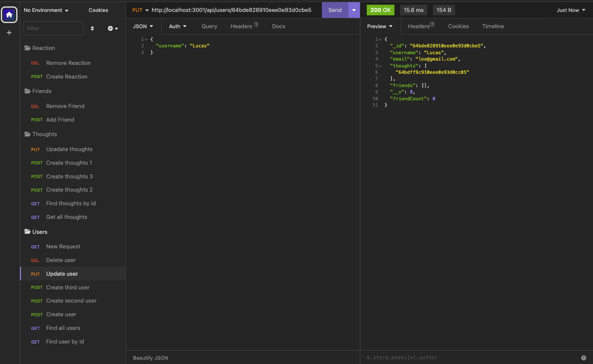
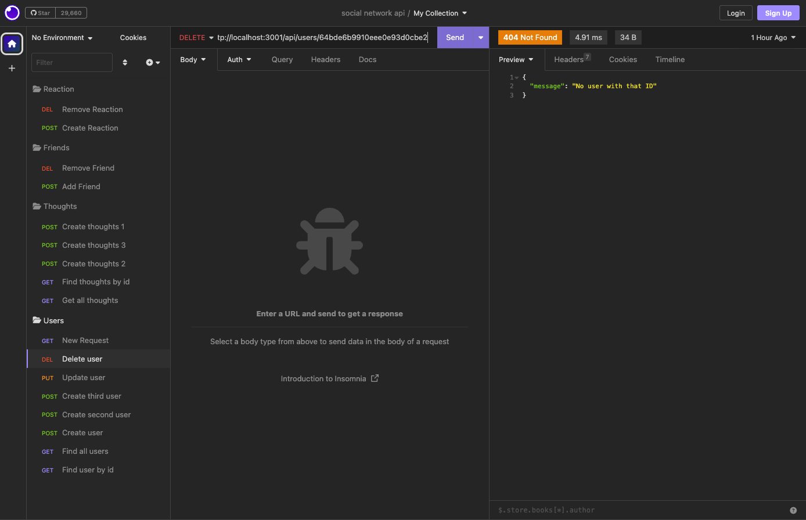
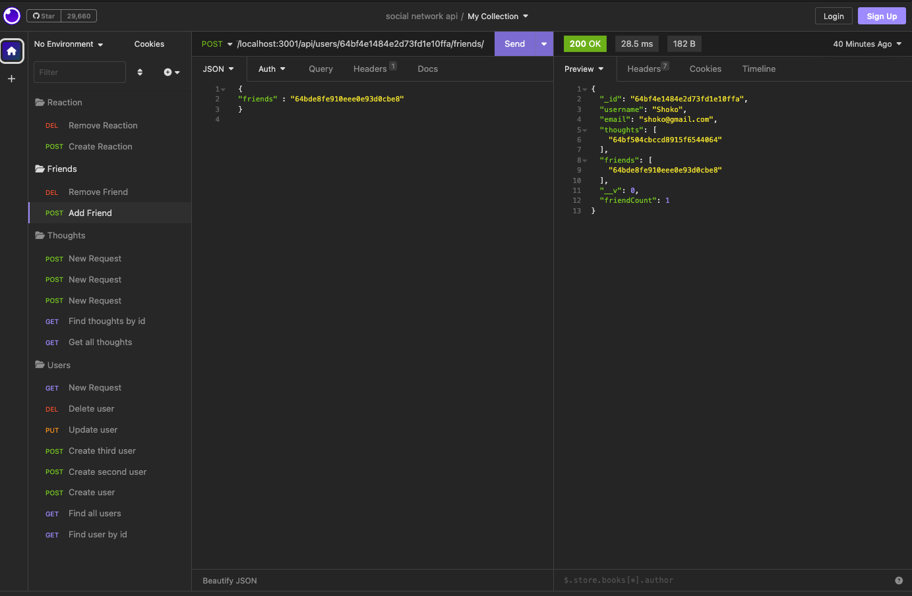
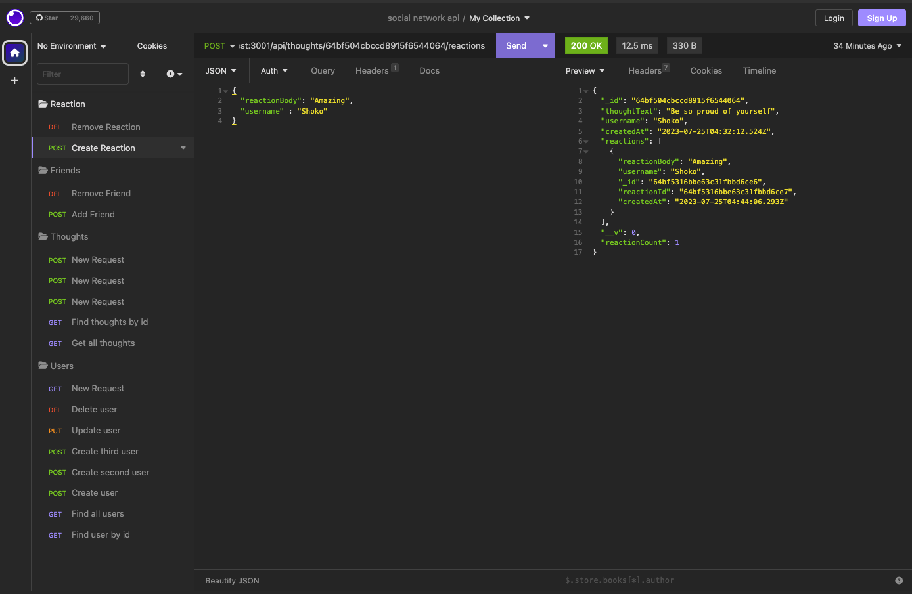
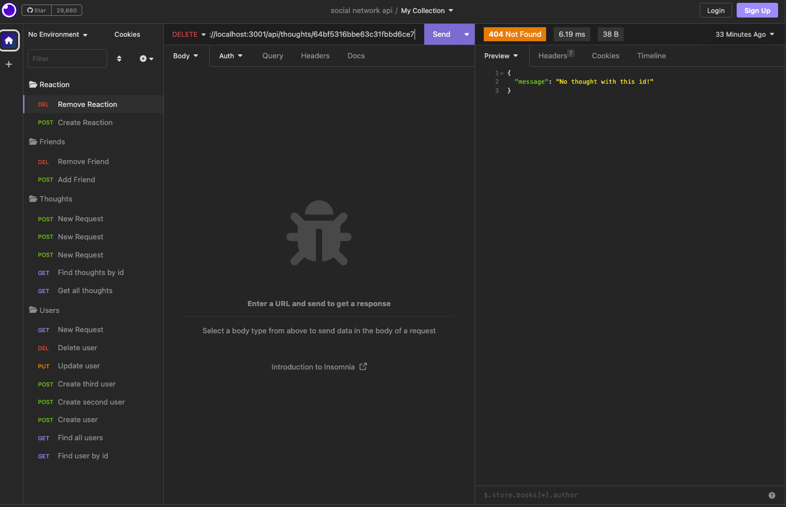

`# social-network-api
## Description
To build an API for a social network web application where users can share their thoughts, react to friends’ thoughts, and create a friend list. 

## Table of Contents
* [Installation](#installation)
* [Usage](#usage)
* [Link](#link)
* [License](#license)

## Installation
Express.js for routing, a MongoDB database, and the Mongoose ODM.

## Usage
1.GET routes to return all users and all thoughts being tested in Insomnia

2.GET routes to return a single user and a single thought being tested in Insomnia

3.The POST, PUT, and DELETE routes for users being tested in Insomnia

4.the POST and DELETE routes for a user’s friend list being tested in Insomnia

5.the POST and DELETE routes for reactions to thoughts being tested in Insomnia

## Link
[Github repository](https://github.com/Shok1to/social-network-api)

[social network api video demo]()

## License

